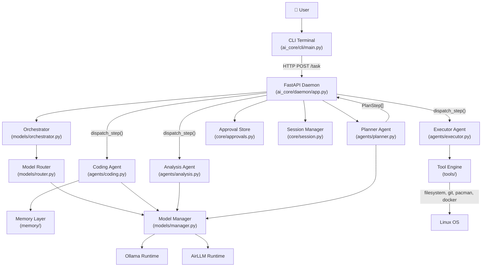
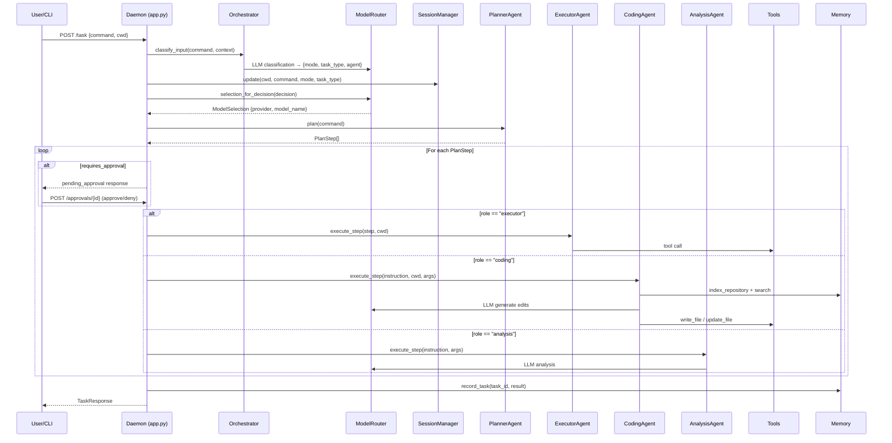

# Multi-Agent Architecture — Detailed Analysis Report

## Executive Summary

The **AI_Native_Custom_Distro** project implements a **4-agent, plan-dispatch-execute** multi-agent architecture for an AI-native developer operating environment. The system runs as a local **FastAPI daemon** that receives natural-language commands from a CLI, classifies intent via an **LLM-powered Orchestrator**, generates structured execution plans through a **Planner Agent**, and dispatches individual plan steps to specialized agents (**Executor**, **Coding**, **Analysis**) based on role. A **sandboxed tool engine** prevents direct shell access, and an **approval gateway** pauses risky operations for human confirmation.

---

## System Architecture Overview



---

## The Four Agents

### 1. Planner Agent — [planner.py](file:///home/arjavjain5203/Coding/AI_Native_Custom_Distro/ai_core/agents/planner.py)

| Aspect | Detail |
|--------|--------|
| **Role** | Converts natural-language commands into a list of [PlanStep](file:///home/arjavjain5203/Coding/AI_Native_Custom_Distro/ai_core/core/types.py#8-19) objects |
| **LLM Usage** | Sends a structured prompt to the planning model requesting JSON output |
| **Fallback** | Regex-based rule matching for common patterns (create folder, git init, clone, etc.) |
| **Output** | `list[PlanStep]` — each step has `description`, [role](file:///home/arjavjain5203/Coding/AI_Native_Custom_Distro/ai_core/cli/main.py#98-103), `tool_name`, `args`, `needs_retrieval`, `requires_approval`, `approval_category` |

**Key design**: The planner never executes anything. It only produces a structured plan. If the LLM call fails, it falls back to deterministic regex matching against ~12 common command patterns. It also delegates to sub-pipelines (`coding_pipeline`, `analysis_pipeline`) when the command looks like a coding or analysis task.

### 2. Executor Agent — [executor.py](file:///home/arjavjain5203/Coding/AI_Native_Custom_Distro/ai_core/agents/executor.py)

| Aspect | Detail |
|--------|--------|
| **Role** | Walks approved plan steps one-by-one and calls tools |
| **LLM Usage** | None — purely mechanical dispatch |
| **Tools** | 16 tools: `create_folder`, `create_file`, `read_file`, `write_file`, `update_file`, `list_files`, `git_init`, `git_commit`, `clone_repo`, `create_branch`, `push_changes`, `create_repository`, `pacman_install`, `pacman_remove`, `pacman_query`, `docker_check`, `docker_run_command` |
| **Output** | [TaskResult](file:///home/arjavjain5203/Coding/AI_Native_Custom_Distro/ai_core/core/types.py#21-29) with `success`, `message`, [steps](file:///home/arjavjain5203/Coding/AI_Native_Custom_Distro/ai_core/daemon/app.py#187-243), and accumulated `step_results` |

**Key design**: The executor is a **dumb dispatcher** — it maps `step.tool_name` to a function call, resolves paths relative to `cwd`, and collects results. It has no LLM reasoning capability, which keeps execution predictable and auditable.

### 3. Coding Agent — [coding.py](file:///home/arjavjain5203/Coding/AI_Native_Custom_Distro/ai_core/agents/coding.py)

| Aspect | Detail |
|--------|--------|
| **Role** | Bounded code generation and modification within a repository |
| **LLM Usage** | Uses the coding model via [ModelManager](file:///home/arjavjain5203/Coding/AI_Native_Custom_Distro/ai_core/models/manager.py#37-340) to generate file edits |
| **Retrieval** | Indexes the repository via [VectorStore](file:///home/arjavjain5203/Coding/AI_Native_Custom_Distro/ai_core/memory/vector_store.py#21-148), searches for the top-5 relevant code chunks, and includes them in the prompt context |
| **Safety** | Refuses to edit files outside the repository root (path traversal check) |
| **Output** | [CodingStepResult](file:///home/arjavjain5203/Coding/AI_Native_Custom_Distro/ai_core/agents/coding.py#16-24) with `changed_files`, `diffs`, `retrieved_files`, `validation` |

**Key design**: The coding agent implements a **RAG (Retrieval-Augmented Generation)** pipeline. It indexes the repository into a vector store, retrieves relevant code chunks via cosine similarity, builds a prompt with context, asks the LLM for JSON-formatted edits, applies them, and generates unified diffs. It also validates the resulting repository state.

### 4. Analysis Agent — [analysis.py](file:///home/arjavjain5203/Coding/AI_Native_Custom_Distro/ai_core/agents/analysis.py)

| Aspect | Detail |
|--------|--------|
| **Role** | Diagnostic reasoning for system/environment issues |
| **LLM Usage** | Uses the analysis model to explain errors and suggest fixes |
| **Output** | [dict](file:///home/arjavjain5203/Coding/AI_Native_Custom_Distro/ai_core/memory/store.py#120-132) with [analysis](file:///home/arjavjain5203/Coding/AI_Native_Custom_Distro/ai_core/agents/planner.py#255-264) (LLM response) and [context](file:///home/arjavjain5203/Coding/AI_Native_Custom_Distro/ai_core/core/session.py#18-25) (original step args) |

**Key design**: The simplest agent — a thin wrapper that builds a diagnostic prompt and returns the model's analysis. Intended for debugging failing tools, inspecting package state, and interpreting error output.

---

## Multi-Agent Coordination & Dispatch

The coordination happens in [daemon/app.py](file:///home/arjavjain5203/Coding/AI_Native_Custom_Distro/ai_core/daemon/app.py) through three key functions:

### [dispatch_step()](file:///home/arjavjain5203/Coding/AI_Native_Custom_Distro/ai_core/daemon/app.py#172-180) — The Role-Based Router (Line 172-179)

```python
def dispatch_step(step: PlanStep, cwd: str) -> Any:
    instruction = str(step.args.get("instruction", step.description))
    if step.role == "coding":
        return coding_agent.execute_step(instruction, cwd, step.args)
    if step.role == "analysis":
        return analysis_agent.execute_step(instruction, step.args)
    return executor.execute_step(step, cwd=cwd)
```

Each [PlanStep](file:///home/arjavjain5203/Coding/AI_Native_Custom_Distro/ai_core/core/types.py#8-19) carries a [role](file:///home/arjavjain5203/Coding/AI_Native_Custom_Distro/ai_core/cli/main.py#98-103) field (`"executor"`, `"coding"`, or `"analysis"`) that determines which agent handles it. This is the **central multi-agent dispatch mechanism**.

### [execute_steps()](file:///home/arjavjain5203/Coding/AI_Native_Custom_Distro/ai_core/daemon/app.py#187-243) — The Execution Loop (Lines 187-242)

Iterates through plan steps sequentially. Before executing each step, it checks `requires_approval` — if true, it pauses execution, creates an [ApprovalRequest](file:///home/arjavjain5203/Coding/AI_Native_Custom_Distro/ai_core/core/types.py#41-51), and returns a `pending_approval` status. When the user approves (via the CLI or API), execution resumes from the paused step index.

### Request Lifecycle



---

## Intent Classification Layer

### Orchestrator — [orchestrator.py](file:///home/arjavjain5203/Coding/AI_Native_Custom_Distro/ai_core/models/orchestrator.py)

The Orchestrator is a **lightweight LLM-powered intent classifier** that runs before planning. It determines:

| Output Field | Allowed Values | Purpose |
|-------------|---------------|---------|
| [mode](file:///home/arjavjain5203/Coding/AI_Native_Custom_Distro/ai_core/models/manager.py#176-200) | [conversation](file:///home/arjavjain5203/Coding/AI_Native_Custom_Distro/ai_core/models/orchestrator.py#174-182), `execution` | Whether the user wants a discussion or an action |
| [task_type](file:///home/arjavjain5203/Coding/AI_Native_Custom_Distro/ai_core/models/router.py#98-105) | `planning`, [coding](file:///home/arjavjain5203/Coding/AI_Native_Custom_Distro/ai_core/models/orchestrator.py#183-191), [analysis](file:///home/arjavjain5203/Coding/AI_Native_Custom_Distro/ai_core/agents/planner.py#255-264), [system](file:///home/arjavjain5203/Coding/AI_Native_Custom_Distro/ai_core/models/orchestrator.py#201-209) | What kind of work this is |
| [agent](file:///home/arjavjain5203/Coding/AI_Native_Custom_Distro/ai_core/models/router.py#98-105) | `planning`, [coding](file:///home/arjavjain5203/Coding/AI_Native_Custom_Distro/ai_core/models/orchestrator.py#183-191), [analysis](file:///home/arjavjain5203/Coding/AI_Native_Custom_Distro/ai_core/agents/planner.py#255-264) | Which agent should lead |
| `confidence` | `0.0 - 1.0` | Classification confidence |

Uses a **5-second timeout** on the LLM call and falls back to regex-based pattern matching if the model fails or times out.

### Model Router — [router.py](file:///home/arjavjain5203/Coding/AI_Native_Custom_Distro/ai_core/models/router.py)

Combines the Orchestrator's classification with the Model Manager to resolve a [ModelSelection](file:///home/arjavjain5203/Coding/AI_Native_Custom_Distro/ai_core/core/types.py#31-39) — the specific provider (`ollama` or `airllm`) and model name for the task type.

---

## Model Management — [manager.py](file:///home/arjavjain5203/Coding/AI_Native_Custom_Distro/ai_core/models/manager.py)

| Feature | Implementation |
|---------|---------------|
| **Dual runtime** | Supports `ollama` (HTTP API at `localhost:11434`) and `airllm` (Python package, on-device) |
| **Auto selection** | In `auto` mode, detects RAM via [/proc/meminfo](file:///proc/meminfo) — uses AirLLM on low-memory systems (<12GB) if available |
| **Per-role models** | Separate model assignments for [orchestrator](file:///home/arjavjain5203/Coding/AI_Native_Custom_Distro/ai_core/models/orchestrator.py#52-61), `planning`, [coding](file:///home/arjavjain5203/Coding/AI_Native_Custom_Distro/ai_core/models/orchestrator.py#183-191), [analysis](file:///home/arjavjain5203/Coding/AI_Native_Custom_Distro/ai_core/agents/planner.py#255-264) |
| **Config cascade** | System config (`/etc/ai-os/models.json`) → User config (`~/.ai-os/models.json`) → Defaults |
| **Default models** | All default to `llama3.2:3b` via Ollama |

---

## Memory & Retrieval Layer

### Task History — [memory/store.py](file:///home/arjavjain5203/Coding/AI_Native_Custom_Distro/ai_core/memory/store.py)
SQLite-backed storage for completed tasks (`task_history` table). Records task ID, command, CWD, success status, steps, and results.

### Vector Store — [memory/vector_store.py](file:///home/arjavjain5203/Coding/AI_Native_Custom_Distro/ai_core/memory/vector_store.py)
Repository indexing and semantic search. Indexes all supported files ([.py](file:///home/arjavjain5203/Coding/AI_Native_Custom_Distro/tests/conftest.py), [.md](file:///home/arjavjain5203/Coding/AI_Native_Custom_Distro/README.md), [.txt](file:///home/arjavjain5203/Coding/AI_Native_Custom_Distro/requirements.txt), `.toml`, `.yaml`, `.yml`, `.json`), stores embeddings in SQLite, and supports optional FAISS acceleration. Uses a deterministic hash-based embedding provider as a v1 fallback.

### Embedding Provider — [memory/embeddings.py](file:///home/arjavjain5203/Coding/AI_Native_Custom_Distro/ai_core/memory/embeddings.py)
A 256-dimensional deterministic hashing-based embedding (not neural). Tokenizes text, hashes tokens to vector positions, normalizes. Suitable for v1 prototype retrieval.

---

## Safety & Approval System

### Approval Store — [core/approvals.py](file:///home/arjavjain5203/Coding/AI_Native_Custom_Distro/ai_core/core/approvals.py)

- Pauses execution for risky steps (`git_push`, `package_install`, `shell_command`, `file_overwrite`)
- Uses cryptographic tokens (`secrets.token_urlsafe`) for approval validation
- Auto-expires stale approvals after 5 minutes (TTL)
- Supports approve/deny decisions via the API

### Tool Engine Sandboxing — [tools/](file:///home/arjavjain5203/Coding/AI_Native_Custom_Distro/ai_core/tools/__init__.py)

5 tool modules provide a controlled interface to the OS:

| Module | Tools |
|--------|-------|
| [filesystem.py](file:///home/arjavjain5203/Coding/AI_Native_Custom_Distro/ai_core/tools/filesystem.py) | `create_file`, `create_folder`, `list_files`, `read_file`, `update_file`, `write_file` |
| [git_tools.py](file:///home/arjavjain5203/Coding/AI_Native_Custom_Distro/ai_core/tools/git_tools.py) | `git_init`, `git_commit`, `clone_repo`, `create_branch`, `push_changes` |
| [github_tools.py](file:///home/arjavjain5203/Coding/AI_Native_Custom_Distro/ai_core/tools/github_tools.py) | `create_repository`, `create_branch_reference`, `push_file_contents` |
| [system_tools.py](file:///home/arjavjain5203/Coding/AI_Native_Custom_Distro/ai_core/tools/system_tools.py) | `pacman_install`, `pacman_query`, `pacman_remove`, `docker_check`, `docker_run_command` |
| [shell.py](file:///home/arjavjain5203/Coding/AI_Native_Custom_Distro/ai_core/tools/shell.py) | `run_shell_command` (wrapped with `ToolExecutionError`) |

Models never directly execute shell commands — all OS mutations go through these typed tool functions.

---

## Session Context — [core/session.py](file:///home/arjavjain5203/Coding/AI_Native_Custom_Distro/ai_core/core/session.py)

Thread-safe in-memory session tracking (keyed by `cwd`). Stores `last_mode`, `last_task_type`, and up to 6 recent messages. Fed into the Orchestrator prompt for context-aware classification.

---

## CLI Interface — [cli/main.py](file:///home/arjavjain5203/Coding/AI_Native_Custom_Distro/ai_core/cli/main.py)

The CLI is a thin HTTP client that communicates with the daemon via REST:
- Interactive REPL mode (`ai-os>` prompt)
- One-shot command mode (`ai-os create folder myproject`)
- Built-in commands: [health](file:///home/arjavjain5203/Coding/AI_Native_Custom_Distro/ai_core/daemon/app.py#244-251), [runtime](file:///home/arjavjain5203/Coding/AI_Native_Custom_Distro/ai_core/models/manager.py#120-133), [models](file:///home/arjavjain5203/Coding/AI_Native_Custom_Distro/ai_core/models), task history
- **Inline approval flow**: When the daemon returns `pending_approval`, the CLI prompts the user with `[y/N]` and submits the decision

---

## Test Coverage

The project has **12 test files** covering all major subsystems:

| Test File | Covers |
|-----------|--------|
| [test_agents.py](file:///home/arjavjain5203/Coding/AI_Native_Custom_Distro/tests/test_agents.py) | Planner, Executor integration |
| [test_coding_agent.py](file:///home/arjavjain5203/Coding/AI_Native_Custom_Distro/tests/test_coding_agent.py) | CodingAgent RAG pipeline |
| [test_api.py](file:///home/arjavjain5203/Coding/AI_Native_Custom_Distro/tests/test_api.py) | FastAPI daemon endpoints |
| [test_cli.py](file:///home/arjavjain5203/Coding/AI_Native_Custom_Distro/tests/test_cli.py) | CLI commands and dispatch |
| [test_orchestrator.py](file:///home/arjavjain5203/Coding/AI_Native_Custom_Distro/tests/test_orchestrator.py) | Intent classification |
| [test_router.py](file:///home/arjavjain5203/Coding/AI_Native_Custom_Distro/tests/test_router.py) | Model routing |
| [test_model_manager.py](file:///home/arjavjain5203/Coding/AI_Native_Custom_Distro/tests/test_model_manager.py) | Runtime selection |
| [test_airllm_client.py](file:///home/arjavjain5203/Coding/AI_Native_Custom_Distro/tests/test_airllm_client.py) | AirLLM runtime |
| [test_memory.py](file:///home/arjavjain5203/Coding/AI_Native_Custom_Distro/tests/test_memory.py) | Task history store |
| [test_vector_store.py](file:///home/arjavjain5203/Coding/AI_Native_Custom_Distro/tests/test_vector_store.py) | Repository indexing |
| [test_session.py](file:///home/arjavjain5203/Coding/AI_Native_Custom_Distro/tests/test_session.py) | Session context |
| [test_hardware.py](file:///home/arjavjain5203/Coding/AI_Native_Custom_Distro/tests/test_hardware.py) | Hardware detection |

---

## Key Architectural Patterns

| Pattern | Where Used |
|---------|-----------|
| **Plan → Approve → Execute** | Planner produces steps, approval gates risky ones, executor/coding/analysis agents execute |
| **Role-based dispatch** | `PlanStep.role` determines which agent handles each step |
| **LLM with deterministic fallback** | Orchestrator, Planner, and Router all have regex-based fallbacks if LLM fails |
| **RAG (Retrieval-Augmented Generation)** | CodingAgent indexes repo, retrieves relevant chunks, injects into LLM prompt |
| **Hardware-aware routing** | ModelManager auto-selects Ollama vs AirLLM based on available RAM |
| **Config cascade** | System → User → Env vars → Defaults for model configuration |
| **Sandboxed tool execution** | All OS mutations go through typed tool functions, never raw shell |
| **Token-gated approvals** | Cryptographic tokens prevent replay attacks on approval endpoints |

---

## Summary

The project implements a **well-structured, deterministic multi-agent system** that avoids the common pitfall of unpredictable autonomous agent loops. Each agent has a single responsibility, the coordination is explicit (not emergent), and safety is enforced through tool sandboxing and approval gating. The architecture is designed for local-first, privacy-preserving AI development assistance running on Arch Linux with Ollama.
